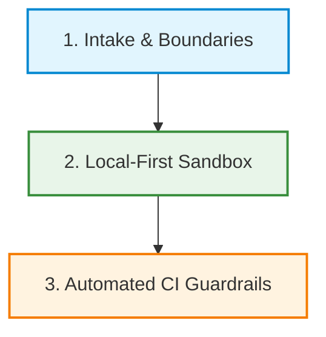

# Module 13-D — AI-Assisted Engineering Workflow Case Study

## Project Overview

This case study outlines the design and enforcement of an **AI-Assisted Engineering Workflow** implemented in the Chrome DevTools Cloud Migration Lab. By formalizing interaction protocols, strict branching lifecycles, automated repository guardrails, and local-first verification rules, we established a reproducible framework that allows developers to safely pair program with AI agents without introducing security risks, credentials, data leaks, or budget overruns.

---

## 1. The Challenge

While AI coding assistants greatly accelerate code generation (often termed "vibe coding"), using them without strict governance introduces several engineering and operational risks:
* **Security & Credential Leakage**: Agents may accidentally hardcode API keys, tokens, or write variables to tracked `.env` files.
* **Data Privacy Violations (PHI/PII)**: In healthcare-related contexts, agents might request or commit real patient data or database exports.
* **Working Tree Pollution**: Caches, virtual environments (`.venv`), or temporary files may be checked in, bloating the repository.
* **Inconsistent Branching**: Agents might make broad, uncoordinated edits directly on the `main` branch, leading to merge conflicts.
* **Bypassing Local Verification**: Code may be pushed and PRs opened without compiling the code locally or verifying runtime behavior on loopback interfaces.

---

## 2. The Solution: Structured AI Governance

We built a defense-in-depth, local-first workflow model to address these challenges, dividing the solution into three main pillars:



### Pillar 1: Intake & Boundary Verification
* **Policy Binding**: AI agents are mandated to read the project's health ecosystem boundaries and guardrails at the start of any conversation.
* **Placeholder Rule**: All configurations, secrets, and URLs must use synthetic placeholders (e.g. `YOUR_API_KEY_HERE`) to prevent accidental leaks.

### Pillar 2: Local-First Sandbox & Verification
* **Local Compilation**: AI agents must execute compile-time syntax checks (e.g., `python -m py_compile`) on all modified scripts.
* **Isolated Execution**: Web surfaces are served on local loopback addresses (port `8097`/`8090`). No public domains or cloud hosting are used during development.
* **DevTools Auditing**: Agents must verify that HTTP headers, local storage, and console logs are safe and free of warnings before proposing changes.

### Pillar 3: Automated Repository Guardrails (CI)
To back up the procedural guidelines, we implemented a GitHub Actions workflow (`repo-guardrails.yml`) that automatically runs on every Pull Request:
* **Blocked Paths Check**: Instantly fails the build if blocked files (e.g. `.env`, `.venv`, `__pycache__`, `package-lock.json`) are tracked.
* **Secret Scan**: Uses regex filters to detect API keys, private keys, or tokens before they are merged into `main`.
* **Required Docs Gate**: Ensures key documentation files exist and have not been deleted.

---

## 3. Operational Git Routine

We enforced a strict cross-environment synchronization process between local Windows environments and remote Cloud Shell instances:

```text
[Local Dev Workspace] -> Git Push -> [GitHub PR Check] -> Squash Merge -> [Cloud Shell Sync]
```

1. **Checkout & Pull**: Always sync the active local workspace with remote `main` before starting a branch.
2. **Semantic Branching**: Use dedicated branches for scoped tasks (e.g. `docs/module-13a-...` or `feat/module-10b-...`).
3. **Draft & Review PRs**: Create PRs in draft or open states, running pre-commit checks and listing a standardized PR readiness report.
4. **Branch Deletion**: Delete branches locally and remotely immediately after merging to keep the repository history clean.

---

## 4. Key Takeaways and Portfolio Value

Enforcing this workflow demonstrates strong **Engineering Governance, DevSecOps discipline, and AI Integration expertise**:
* **Zero Cost**: Built and verified using local tools, mocking, and free GitHub Actions runner minutes.
* **Security Compliance**: Achieved a 100% pass rate on repo-guardrails checks, ensuring zero secrets or PHI entered the repository.
* **Scalability**: The SOP handbook can be easily adapted for engineering teams looking to safely onboard AI tools into corporate environments.
* **Collaboration Parity**: The sync routines ensure that multiple developers (and AI agents) can work seamlessly across different local and cloud-based terminals.
